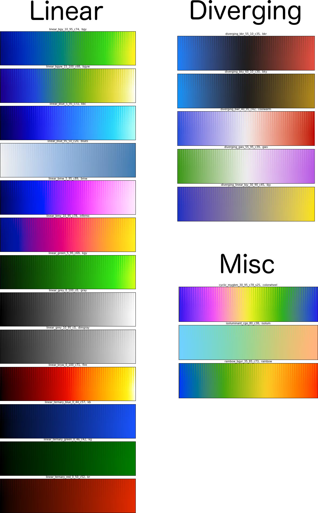

colorcet
--------

[colorcet](https://github.com/bokeh/colorcet) is a collection of
perceptually uniform colormaps for use with Python plotting programs like
[bokeh](http://bokeh.pydata.org),
[matplotlib](http://matplotlib.org),
[holoviews](http://holoviews.org), and
[datashader](https://github.com/bokeh/datashader).

Apart from the four [uniform colormaps now provided with
matplotlib](http://matplotlib.org/users/colormaps.html), most
colormaps shipping with Python plotting Python programs are highly
perceptually nonuniform.  That is, small changes in data values
result in large changes in the perceptual appearance of the
corresponding colors, or vice versa.  For instance, the popular matplotlib
"hot" and "jet" colormaps have long stretches where the apparent
colors change imperceptibly, such as the yellow region in "hot" and
the cyan/green region in "jet":

     

When colormaps are used for visualizing scientific datasets, these
perceptual nonlinearities can make interpretation of this data very
difficult, because false boundaries appear in the data, and genuine
boundaries and changes can be obscured.

To combat these issues, Peter Kovesi at the Center for Exploration
Targeting created a set of colormaps that are sampled uniformly in a
perceptual color space, using methods he describes in a [paper on
arXiv](https://arxiv.org/abs/1509.03700).  For instance, the
perceptually uniform versions of the above colormaps are called "fire"
and "rainbow" in this package:


You should be able to see the differences right away, revealing more
detail, more faithfully than if you use non-uniform maps.  For
instance, here is the same population-density dataset (from
[datashader](https://github.com/bokeh/datashader)) rendered with the
original matplotlib "hot" colormap:


and with colorcet's "fire" colormap:


It should be obvious that the "hot" version completely washes out
detail at the high end, as if the image is overexposed, while "fire"
makes detail visible throughout the data range.  Yet the qualitative
effect is still roughly similar, allowing "fire" to be used in nearly
any situation where the original "hot" was useful.

Peter provides [versions of 50 perceptually uniform colormaps for a
variety of different plotting programs](http://peterkovesi.com/projects/colourmaps), 
and this package provides those colormaps ready to use from within Python
programs.  The colormaps are all illustrated in an 
[example notebook](https://bokeh.github.io/colorcet) that describes the 
different types available and allows you to test how perceptually
uniform they are on your particular display device.

Note that Peter's methods differ from those used in Matplotlib's
uniform colormaps (as implemented in their [viscm
tool](https://github.com/matplotlib/viscm), which (apart from using a
different color model) are designed to satisfy different constraints.
For instance, mpl's colormaps are always perceptually uniform in their
monochrome representation, not just their original color
representation, which is not necessarily true of these colormaps.  On
the other hand, colormaps like "fire" above, i.e., a usable
perceptually equivalent of matplotlib/matlab's "hot", are not
obtainable using viscm in any straightforward way, making it more
difficult to create the full range of useful colormaps with that tool.
In any case, this package focuses on making a set of useful colormaps
readily available from within Python programs, rather than providing
tools for building novel colormaps, for which see the 
[viscm tool](https://github.com/matplotlib/viscm) and
[Peter's original site]](http://peterkovesi.com/projects/colourmaps). 


## Installation

colorcet is available on most platforms using the `conda` package manager,
from the `bokeh` channel:

```
conda install -c bokeh colorcet
```

or by using pip:

```
pip install colorcet
```

Alternatively, you can manually install from the repository if you
wish to be able to modify the code over time:

```
git clone https://github.com/bokeh/colorcet.git
cd colorcet
python setup.py develop
```

## Learning more

You can see all the details about the methods used to create these
colormaps in [Peter Kovesi's 2015 arXiv
paper](https://arxiv.org/pdf/1509.03700v1.pdf).  Other useful
background is available in a [1996 paper from
IBM](http://www.research.ibm.com/people/l/lloydt/color/color.HTM).

The matplotlib project also has a number of relevant resources,
including an excellent 
[2015 SciPy talk](https://www.youtube.com/watch?v=xAoljeRJ3lU), the
[viscm tool for creating maps like the four in mpl](https://github.com/matplotlib/viscm), the
[cmocean site](http://matplotlib.org/cmocean/) collecting a set of maps created by viscm, 
and the [discussion of how the mpl maps were created](https://bids.github.io/colormap/).


# Samples

All the colorcet colormaps that have short, memorable names (which are probably
the most useful ones) are visible here:



But the complete set of 50+ is shown in the
[example notebook](https://bokeh.github.io/colorcet).
