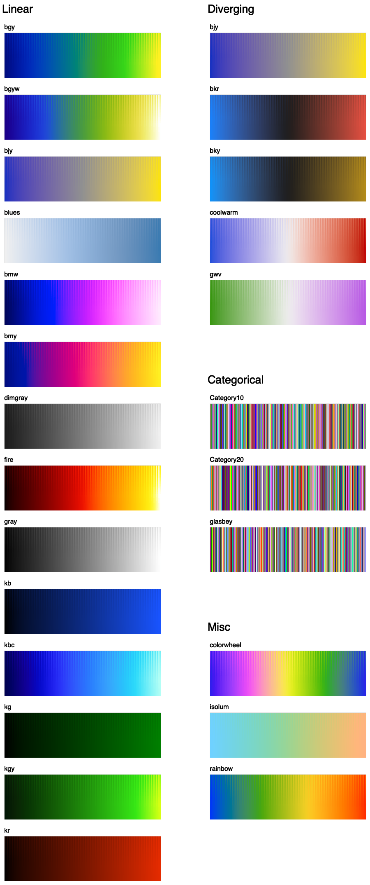

<br>

-----------------

# Colorcet: Collection of perceptually uniform colormaps

|    |    |
| --- | --- |
| Build Status | [](https://travis-ci.org/pyviz/colorcet) [](https://ci.appveyor.com/project/pyviz/colorcet/branch/master) |
| Latest dev release | [](https://github.com/pyviz/colorcet/tags) |
| Latest release | [](https://github.com/pyviz/colorcet/releases) [](https://pypi.python.org/pypi/colorcet) [](https://anaconda.org/pyviz/colorcet) [](https://anaconda.org/conda-forge/colorcet) [](https://anaconda.org/anaconda/colorcet) |
| Docs | [](https://github.com/pyviz/colorcet/tree/gh-pages) [](http://colorcet.pyviz.org) |


## What is it?

Colorcet is a collection of
perceptually uniform colormaps for use with Python plotting programs like
[bokeh](http://bokeh.pydata.org),
[matplotlib](http://matplotlib.org),
[holoviews](http://holoviews.org), and
[datashader](https://github.com/bokeh/datashader) based on the
set of [perceptually uniform colormaps](https://arxiv.org/abs/1509.03700) created
by Peter Kovesi at the Center for Exploration Targeting.


## Installation

Colorcet supports Python 2.7, 3.5, 3.6 and 3.7 on Linux, Windows, or Mac
and can be installed with conda:

```
    conda install colorcet
```

or with pip:

```
    pip install colorcet
```

Once installed you can copy the examples into the current directory using the colorcet command and run them using the Jupyter notebook:

```
colorcet examples
cd colorcet-examples
jupyter notebook
```

(Here colorcet examples is a shorthand for colorcet copy-examples --path colorcet-examples && colorcet fetch-data --path colorcet-examples.)

To work with JupyterLab you will also need the PyViz JupyterLab extension:

```
conda install -c conda-forge jupyterlab
jupyter labextension install @pyviz/jupyterlab_pyviz
```

Once you have installed JupyterLab and the extension launch it with:

```
jupyter-lab
```

If you want to try out the latest features between releases, you can get the latest dev release by specifying -c pyviz/label/dev in place of -c pyviz.

For more information take a look at [Getting Started](http://colorcet.pyviz.org/getting_started).

## Learning more

You can see all the details about the methods used to create these
colormaps in [Peter Kovesi's 2015 arXiv
paper](https://arxiv.org/pdf/1509.03700v1.pdf).  Other useful
background is available in a [1996 paper from
IBM](http://www.research.ibm.com/people/l/lloydt/color/color.HTM).

The matplotlib project also has a number of relevant resources,
including an excellent
[2015 SciPy talk](https://www.youtube.com/watch?v=xAoljeRJ3lU), the
[viscm tool for creating maps like the four in mpl](https://github.com/matplotlib/viscm), the
[cmocean site](http://matplotlib.org/cmocean/) collecting a set of maps created by viscm,
and the [discussion of how the mpl maps were created](https://bids.github.io/colormap/).


## Samples

All the colorcet colormaps that have short, memorable names (which are probably
the most useful ones) are visible here:



But the complete set of 50+ is shown in the [User Guide](http://colorcet.pyviz.org/user_guide).


## About PyViz

Colorcet is part of the PyViz initiative for making Python-based visualization tools work well together.
See [pyviz.org](http://pyviz.org) for related packages that you can use with Colorcet and
[status.pyviz.org](http://status.pyviz.org) for the current status of each PyViz project.
